# Louis: Project Log <!-- omit in toc -->

- [Week 1](#week-1)
- [Week 2](#week-2)
- [Week 3](#week-3)
- [No Lecture Week](#no-lecture-week)
- [Week 4](#week-4)
- [Week 5](#week-5)
- [Mid-semester break](#mid-semester-break)
- [Week 6](#week-6)
- [Week 7](#week-7)
- [Week 8](#week-8)
- [Week 9](#week-9)
- [Week 10](#week-10)
- [Week 11](#week-11)
- [Week 12](#week-12)
- [Holidays Week 1](#holidays-week-1)
- [Holidays Week 2](#holidays-week-2)
- [Holidays Week 3](#holidays-week-3)
- [Week 1](#week-1-1)
- [Week 2](#week-2-1)
- [Week 3](#week-3-1)
- [Week 4](#week-4-1)
- [Week 5](#week-5-1)

## Week 1

### Friday March 6

First meeting with Peng and Andreas. Introduction to the project.

## Week 2

### Thursday March 12

Started with Markdown as a log using [Markdown and Visual Studio Code](https://code.visualstudio.com/docs/languages/markdown?fbclid=IwAR1Y7I6vyp4QvUq57frUk-NKwY-bZRNwcU2Cn_B8eS3ybC0qT6pQQnl1fFk) as a guide. Installed `markdownlint`, `Markdown TOC`, `Markdown Shortcuts`, and `Markdown Preview Enhanced`. Potential extensions to consider are `Markdown Theme Kit`, `Markdown Preview Github Styling`.

`Ctrl + K` `V` to open preview.

### Friday Macrh 13

Installed `Markdown All in One` and `Markdown Preview Github Styling`, and uninstalled `Markdown TOC` and `Markdown Shortcuts`.

Meeting with Peng (technical info).

*Improving the Traditional Information Management in Natural Sciences* &mdash; discusses using timestamps as a way of managing data. I think in the case of our project, this isn't too relevant, as we are not collecting any data ourselves and practicing standard version control is sufficient.

## Week 3

### Wednesday March 18

To omit entries from the table of contents, include `<!-- omit in toc -->` at the end of the line. To create a TOC, `Ctrl + P` and type `> Markdown All in One: Create Table of Contents`.

Completed and summarised all *Best Practices* readings. Read chapter 1 of *Hands-On ML*.

### Thursday March 19

**Virtual environment in Python**

1. Install Anaconda [here](https://www.anaconda.com/distribution/#download-section) 
2. Add the following variables to PATH:
   - C:\Users\Louiis\Anaconda3\Scripts
   - C:\Users\Louii\Anaconda3
   - C:\Users\Louii\Anaconda3\Library\bin
3. Run Anaconda Prompt as administrator and run:
   - `pip install --upgrade anaconda-navigator`
   - `pip install --upgrade virtualenv`
   - `pip install --upgrade virtualenvwrapper-win`
4. Navigate to the target path using `cd`
5. Type `virtualenv env` to create a virtual environment called `env`
6. Type `env\Scripts\activate` to activate the environment

**Updates**

- `conda update conda`
- `conda update anaconda`
- `conda update python`
- `pip install --upgrade pip`

Completed chapter 2 of *Hands-On ML*. Quite a good chapter, goes through an entire end-to-end project; may be worth going back and having another read in future. Jupyter notebook stored in OneDrive, and source code for the book can be found [here](https://github.com/ageron/handson-ml).

## No Lecture Week

[No lecture week]

## Week 4

### Friday April 4

To connect to SSH through the University network, connect to Forticlient VPN first (instructions found [here](https://cdn.auckland.ac.nz/assets/auckland/students/academic-information/postgraduate-students/Postgraduate%20support%20and%20services/vpn/how-to-guide-for-forticlient-vpn.pdf)). Also, requires a 2FA code associated with university account, have set up.

Getting an error:
> Unable to establish the VPN connection. The VPN server may be unreachable.(-14)

**RESOLVED:** IT portal request for VPN opened (thanks to Peng); expected delivery date 6th April.

## Week 5

### Monday April 7

In contact with IT to resolve VPN issues &ndash; no avail, I'd already tried everything suggested.

### Tuesday April 8

Contacted IT via phone, tried installing Cisco and other settings &ndash; no luck. Advised to use FlexIT on browsers; installed and successfully launched Putty. Awaiting ssh server address and port number from Peng to connect. Also requested permission for VPN access for undergrad (my original request).

## Mid-semester break

### Friday April 17

First time running CellML. [List of tutorials](https://www.cellml.org/getting-started/tutorials) to get started. In particular, [Introduction to modelling with CellML using COR](https://www.cellml.org/getting-started/tutorials/COR-tutorial) is helpful. Part I is on units and variables.

### Monday April 20

Notes from literature review video written in `progress.md`.

### Tuesday 21 April

VPN successfully logged in; IT ticket closed.

### Thursday 23 April

To log into ssh use

```powershell
cd ../hpc/clin750
```

Began and completed reading through *MEA 2019*.

### Friday 24 April

Started literature review planning.

### Saturday 25 April

Started first draft of literature review.

### Sunday 26 April

Continue working on literature review draft.

## Week 6

### Monday 27 April

This project continues the work from **A Simplified Biophysical Cell Model For Gastric Slow Wave Entrainment Simulation**. I should have planned and structured my lit review by following the Introduction section.

Finished first draft of lit review.

### Thursday 30 April

Received feedback from Peng.

### Friday 1 May

Sanders and Ward, high quality, can adapt figures.

### Saturday 2 May

Started typesetting on LaTex and editting second draft.

### Sunday 3 May

Progress on transferring to LaTex.

### Tuesday 5 May

Added content to Project Scope/Methodology. (No additional feedback/comments from supervisors).
Final literature review submitted.

## Week 7

### Friday 8 May

Meeting notes from Peng:

- Can login with either hpc2 or hpc5
- Use `cd ../..` to navigate
- `ls` to show all items in current directory
- `example_2d.com` default up to 200ms with output every 10ms
- `Output` solution point at every time step
- Type `matlab` to run MATLAB and `exit` to escape
- `stomach.iphist`
- `dipole_calculate` to run `dipole_calculate.m` script
- `test_result.mat` - voltage/solution at time steps
- `.ipcell` extension contain parameters values and initial conditions
- HPC has large memory and has CMISS installed

## Week 8

### Thursday 14 May

**Transfer a file from local machine to remote server**

```bash
# from current cmd directory
scp filename clin750@hpc5.bioeng.auckland.ac.nz:/hpc/clin750
```

**Transfer a directory from local machine to remote server**

```bash
# this will duplicate the directory folder itself
scp -r directoryname clin750@hpc5.bioeng.auckland.ac.nz:/hpc/clin750
```

**Transfer a file from remote server to local machine**

```bash
# destination includes file name, e.g. Desktop/test.txt
scp clin750@hpc5.bioeng.auckland.ac.nz:/hpc/clin750/filename destination
```

**Manipulating files in remote server**

```bash
# change directory
cd ../

# show list of all files in directory
ls

# make a new directory
mkdir test_folder

# create a new file
touch test_file.txt

# copy a file
cp test_file.txt copy_file.txt

# copy a directory
cp -r test_folder new_folder

# rename and/or move a file/directory (leave name empty to keep same)
mv test_file.txt test_folder/new_file.txt

# open a file
open test_file.txt

# remove a file
rm test_file.txt

# remove a directory
rm -r test_folder

# force delete file/directory
rm -rf test_folder
```

**The `screen` command**

`screen` command in Linux provides the ability to launch and use multiple shell sessions from a single ssh session. When a process is started with ‘screen’, the process can be detached from session & then can reattach the session at a later time. When the session is detached, the process that was originally started from the screen is still running and managed by the screen itself. The process can then re-attach the session at a later time, and the terminals are still there, the way it was left.

```bash
# create a new screen
screen

# create a new screen with a name window
screen -S name

# display all screens
screen -ls

# detach screen
screen -d 1234
# (or `ctrl+a` `d`)

# reattach a screen
screen -r 1234

# delete a screen
screen -XS 1234 quit
```

**Windows within a screen**

- Create a new window: `ctrl+a` `c`
- List all windows: `ctrl+a` `w` or `ctrl+a` `"`
- Go to next window: `ctrl+a` `n`
- Go to previous window: `ctrl+a` `p`
- Go to specific window: `ctrl+a` `_` (where `_` is window index)
- Rename window: `ctrl+a` `A`
- Delete current window: `ctrl+a` `k`
- Delete all windows and current session: `ctrl+a` `\`
- Split terminal vertically: `ctrl+a` `|`
- Split terminal horizontally: `ctrl+a` `S`
- Close a pane: `ctrl+a` `X`

**Run CMISS***

```bash
cm file.com
```

### Friday 15 May

**Meeting notes:**

- Not many updates for simulation-side from Peng
- Will look into why `cm` command not working
- Don't run too many screen sessions

Goal for next week: a figure, some output.

## Week 9

### Thursday 21 May

Learnt about *batch* files. Switched to PuTTY instead of Windows OpenSSH Client as there's more technical support for writing PuTTY batch files. Wrote one to automate logging in with password.

You can check prompt using `echo $PS1` or change prompt using the `PS1=""` command ([more info](https://www.cyberciti.biz/tips/howto-linux-unix-bash-shell-setup-prompt.html)).

### Friday 22 May

Possible solutions:

- Get `cm` path from Peng (`which cm`)

> /hpc/cmiss/bin/x86_64-linux/cm

- Find out why `$HOME` is `people\llin` and not `people\clin750` or something else

> Possibly; Peng will get Tiong to check

Goal for next week: run the CellML simulation by converting it to MATLAB then  varying a range of parameters:

CellML (imtiaz_2002d_noTstart_COR) -> Tools -> CellML export to user defined -> OpenCOR -> Formats -> python/matlab -> save as .m -> run file in matlab.

**Problem resolved!** Tiong has fixed the issue and now the prompt is `[clin750@]` in OpenSSH.

## Week 10

### Thursday 28 May

There is a section symbol § - may be useful to use.

## Week 11

### Thursday 4 April

The `/bin/bash` at the end of the command file is necessary to keep the window open.

Switched to WinSCP for GUI and scripting functionality.

### Friday 5 April

- What is $Cor\cdot{()}$?

> Cor is a scaling parameter - easy way of changing the frequency of the model (beyond just using existing parameters); from 3cpm to 26cpm.

- $k_r$ and $k_a$ are both cytosolic Ca2+ threshold for $V_3$ but have different values?

> Different constants.

- Can we assume Hill coefficients hold true and cannot be changed?

> Pseudo-empirical values that can be changed.

**Meeting notes:**

- Vary: $\beta$, $\eta$, $IP_3$ - parameters that affect frequency
- Start with 5 or 6 parameters, justify choice with literature review
- Quantify effects of changing parametes $\pm20\%$
- When in 2D model, have to assign a gradient
- Diffusing voltage, COR model provides a solution at one point in the cell; the 2D model uses a 'voltage governing equation' to form a diffusion gradient across points
- In a healthy human stomach, activities occur at 3cpm. The same activity in intestines happen at 12-30 cpm depending on area of intestine and species.

## Week 12

### Friday 12 June

- Which output are we most interested in? $V_m$?

> $Ca_c$ is important as well, it supports movement in the muscle. It is highly correlated and proportional with $V_m$, so we can infer one to the other, but it does provide another dimension for perturbation. Regardless, $V_m$ is still most important.

- Are the parameter values in the paper valid? (using those values for $\eta$ and $\beta$ give weird results)

> Ignore the values in paper and just change around those in the existing file.

- We can easily change frequency just by changing $Cor$, so how should we control much we rely on this pseudo-constant?

> Strictly speaking, no. Since altering the parameters alone will not get us anywhere close to 26cpm, we use $Cor$ to do that in the 1D case. Then for 2D, we modify $\eta$, $\beta$, etc. to assign a gradient across the array of electrodes for various parameter values.

**Meeting notes:**

There is an old paper that proposes a more complex cell model that accounts for the effect of acetylcholine. Use the new parameter as an additional coefficient to current.

## Holidays Week 1

Tried integrating ACh model into existing cell modelling. Converted `corrias_buist_2007.cellml` to MATLAB and piped generated $h_{Ca}$ values to main `imtiaz_2002d_noTstart_COR_exported.m`. Ran into problems with dimensions not matching, despite using identical time periods and time steps.

(Run it to find difference in dimensions)

**Meeting notes:**

- Peng has had discussions with neuroscientists that deal extensively with acetylcholine
- Non-selective cationic channels (NSCC)
- ACh modulates the amount of current that can flow through ion conductance channels
- Changing the ion conductances affect the results a lot (plots in OpenCOR)
- $I_{BK}$, $I_{Ca}$, $I_{Na}$ - three ion conductances to target and change
- Charged ions flowing in and out of cell
- Reducing these values simulate partial inhibition
- Can reduce/increase incrementally, either individually or in combination - see how it affects activities

- Can still change frequency parameter (so 4 parameters in total)
- Limits the scope but must justify

- Cell model in OpenCOR for electrodes and tissue model in CMISS to stitch everything together
- Match cell model frequency and amplification with experimental data, then just throw everything into tissue model
- Note that the domain of the tissue model may need to be reduced to get a good 2D match

- Previous $h_{Ca}$ variable in Corras & Buist 2007 effectively does the same thing as modifying the ion conductance values themselves so leave for now (may add later)

**Goal for next week:** have a good range of parameters and plot the results.

## Holidays Week 2

Meetings notes from Peng:

First big task: calibrating CellML model over a range of parameters and generate calibration curves and voltage output. Compare and contrast with experimental data - does it match? Which parameters are best?

Keep $Cor$ constant for all analyses; 6 is a good value. $Cor$ is difficult to justify so best to find a good value for it (e.g. 6) and keep it constant across the entire domain.

For the baseline model, keep $Cor$ at a constant value, then adjust $\eta$ and $\beta$ to get frequencies above and below experimental data. For drug-effect simulation, can also change ion condutance $I_{BK}$, $I_{Ca}$, and $I_{Na}$.

After finding suitable parameters for the cell model, feed those values into the tissue model and run in CMISS. To pipe the values in, use the files in `mfiles`.

`dipole_calculate.m` creates plots of the tissue model results.

## Holidays Week 3

The baseline frequency vary widely across the three experiments. Ach-AT has frequency as low as 12 (at 2) and up to 20 (at 6), but mostly in the range of 18 - 20cpm. In Ach-Hex, frequency ranges from 14 to 17.9, but most are near 17cpm. Beth-AT is most consistent, with a slight right-tailed but mostly uniform distribution from 18 to 21cpm.

With default $\eta$=0.0389 and $\beta$=0.000975:

- $Cor$ = 6: 27cpm.
- $Cor$ = 5: 23cpm.
- $Cor$ = 4: 18cpm.
- $Cor$ = 3: 14cpm.
- $Cor$ = 2: 9cpm.

$Cor$=4 seems to be the most appropriate value with default parameters.

Do we just count the number of peaks in a 60000ms period to get frequency in cpm?

> Run until steady state

What does each row of data mean? Do they represent one electrode each?

What unit/measurement is amplitude? Is velocity relevant? What is percentage?
> Amplitude is of voltage, but relative to extracellular voltage, making it a difficult characteristic to match. A percentage/relative difference or change might be more feasible but may still not match well. Velocity is wave propagation velocity and simulated in CMISS. It's provides another characteristic that can be matched in the tissue model. Percentage is the proportion of time activities are occuring in the same general direction.


With $Cor$=4 and $\eta$=0.0389:

- $\beta$ = 0.0004: 16cpm.
- $\beta$ = 0.0005 to 0.0007: 17cpm.
- $\beta$ = 0.0008 to 0.0009: 18cpm.
- $\beta$ = 0.000975: 18cpm (default).
- $\beta$ = 0.001 to 0.0012: 19cpm.
- $\beta$ = 0.0013 to 0.0014: 20cpm.
- $\beta$ = 0.0015: 21cpm.

*Note: intervals between values may belong to either the upper or lower domain. E.g. 0.000975 gives 18cpm, which is in the lower domain bracket despite being closer to the upper interval.*

With $Cor$=4 and $\beta$=0.000975:

- $\eta$ = 0.01: 1cpm.
- $\eta$ = 0.02: 1cpm.
- $\eta$ = 0.0389: 18cpm (default).
- $\eta$ = 0.04: 17cpm.
- $\eta$ = 0.05: 6cpm.
- $\eta$ = 0.06: 3cpm.

Further analysis:

- $\eta$ = 0.03: 31cpm.
- $\eta$ = 0.033: 27cpm.
- $\eta$ = 0.036: 22cpm.
- $\eta$ = 0.0389: 18cpm.
- $\eta$ = 0.04: 17cpm.
- $\eta$ = 0.045: 11cpm.
- $\eta$ = 0.05: 6cpm.

Frequency looks like a right-skewed curve when plotted against $\eta$.

**Meeting notes:**

- It is easier to use the range of $\eta$ in which frequency is an upstroke due to the positive gradient. We don't want to be increasing $\eta$ and suddenly the behaviour changes unexpectedly (i.e. freq. decreases). $\beta$ is approximately linear so will be easier to adjust within a larger range.
- **Important note**: neither $\eta$ nor $\beta$ represent physiological properties. The values of these parameters have been derived to fit empirical data. There is no need to justify a quantitative physiological trait.
- Can look into other characteristics of trace, e.g. upstroke, width.

We don't have other characteristics of experimental data so how do we match e.g. upstroke, width etc.?

## Week 1

### Monday

GitHub repository, VPN, and SSH setup on tablet.

Edited batch command file: successfully automated `dipole_calculate.m`.

### Tuesday

Streamlined the code for readibility and easier parameterisation. Can now output multiple plots of voltage over time for different parameter values. Plots below are of 20 uniformly distributed parameter values for one variable while keeping the other two constant at default value. Frequencies are taken at steady state (i.e. after 10 minutes (600,000s)) of simulation for a period of 60 seconds (600,000s to 660,000s).

**Changing $\beta$:**
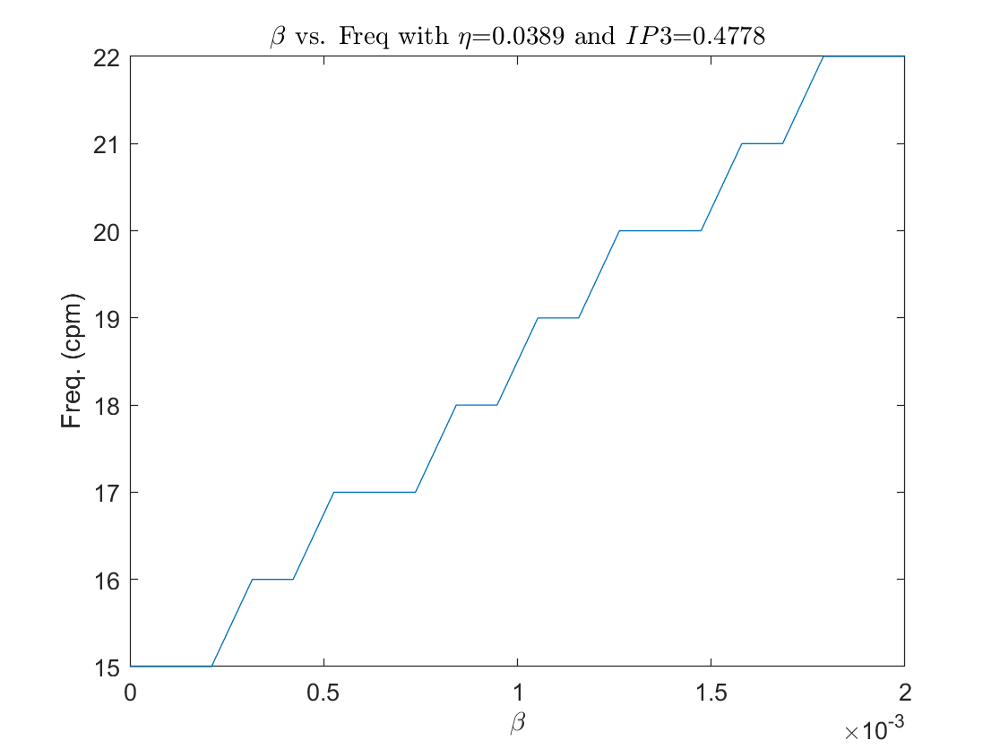

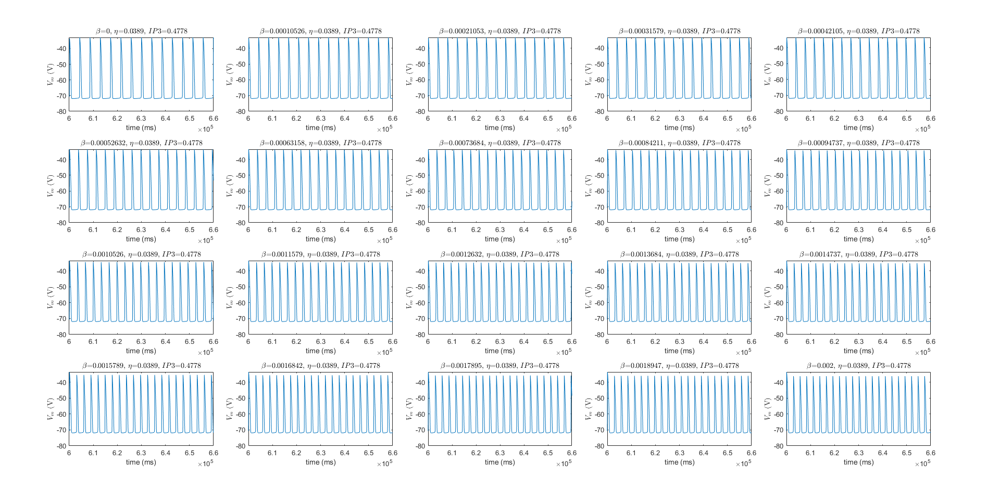

Roughly linear relationship between $\beta$ and frequency.

**Changing $\eta$:**
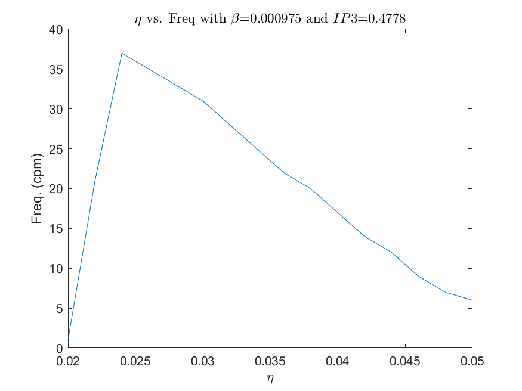

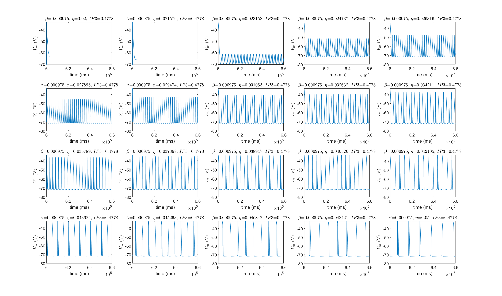

Observe a cliff-type relationship between $\eta$ and frequency with a right-skewed tail.

**Changing $IP3$:**
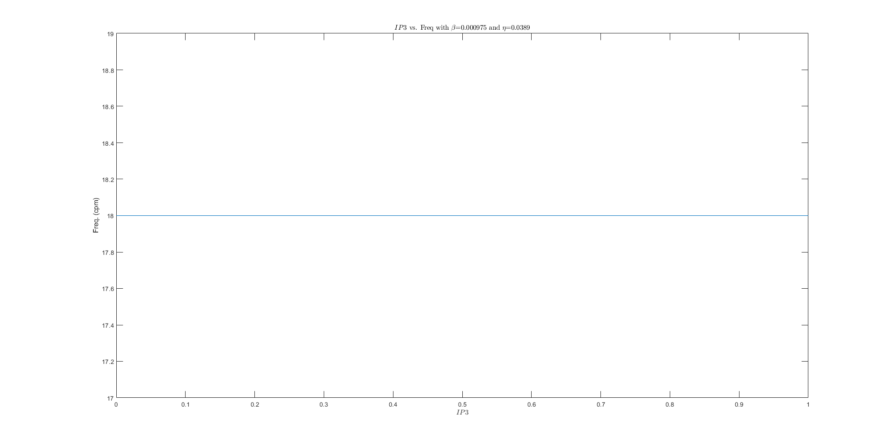

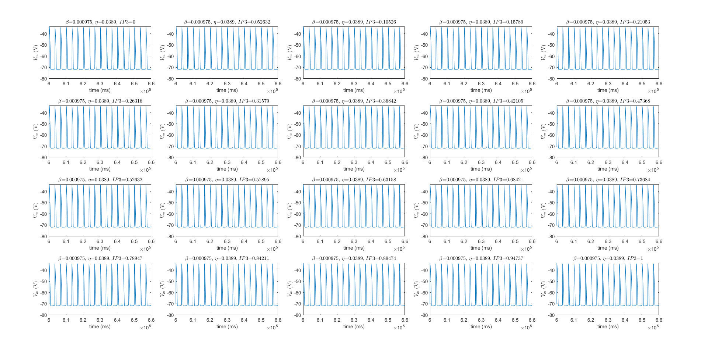

Frequency does not change as $IP3$ is varied.

### Thursday

Meeting agenda:

- Find range of $\eta$ with positive gradient
- Investigate why $IP3$ does not affect frequency
- Find other characteristics that could be useful (upstroke? width?)
  - How to assess these without experimental data?
- Share GitHub repo
- Midyear report
- Future meeting times
- Expectations

**Meetings notes from Peng:**

- $IP3$ is a variable and not a parameter, i.e. it has a value but remains constant. So it is reassuring to see that the model is stable regardless of the value itself
- Upstroke is the elapsed time between resting state (e.g. voltage) and max amplitude. However, it can be difficult to determine the starting point in time as the resting voltage could increase gradually before the sudden uptick. Therefore, it is common to measure upstroke as the time between half amplitude and max amplitude, as both resting state and max amplitude are known. Can also measure from 1/3 amplitude.
- Width suffers a similar problem to upstroke, so take the timespan between when two values occur (e.g. half amplitude, 1/3 amplitude).
- We are not using upstroke and width to parameterise the model. It is used as the predictive component of the model - i.e. using the model to infer the effects of drugs. We can then plot frequency vs. upstroke, or frequency vs. width for both normal behaviour and under the effects of drug.
- We would expect the relationship between freq and upstroke or width to be negative, i.e. the higher the frequency, the shorter the upstroke and width. However, this may not be the case when drugs are applied; expecting arrhythmic activity.
- Mid-year report/presentation is not marked. It's just a check point for progress. Basic structure could be: background, aims, method, prelimary results, next steps, references. A lot of the background/aim would be recycled content from lit review.
- Any day between 8AM to 2PM (except Thursday 11-12)
- Expected faster progression onto the 2D model. The work on the 1D model so far has been good, and is one of the core parts of this project. But the interesting portion is the 2D model and doing some perturbation analysis and other work.
- One more thing that should be done with the 1D model is analysing the effects of ion conductance. Specifically, reducing the conductance variables and plotting its effect against several characteristics.

### Friday

Fine resolution zooming to find range for $\eta$:

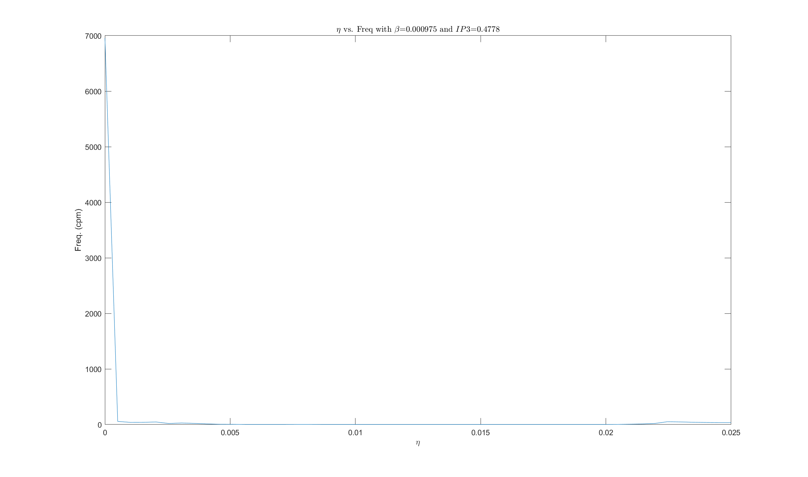
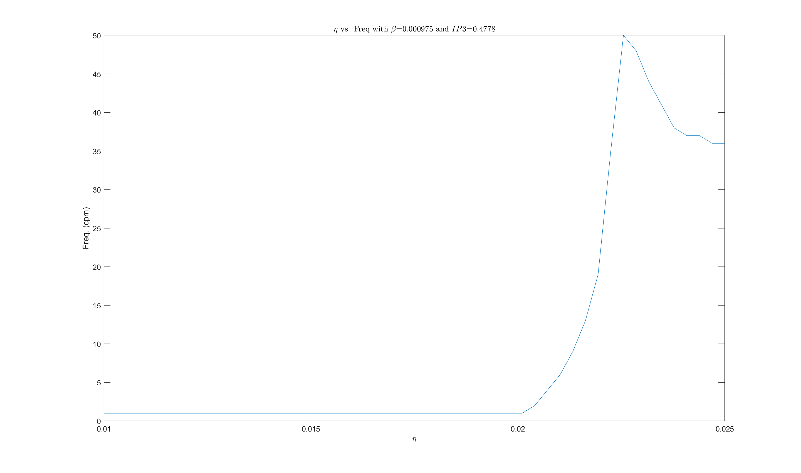

## Week 2

### Monday

**Meeting notes:**

- Storing results before visualisation
- Reinitialise from steady state
- Change conductance variables

### Sunday

Started and completed mid-year presentation.

Kartikey spotted voltage unit in V, but should probably be mV. Lit review paper has mV but model is written with V.

Idea: use `fminsearch` to find best parameter.

Code now prints average run time per iteration to get an idea of how long to run simulation.

Left simulation for 100 values of eta and beta each to run overnight.

## Week 3

### Monday


$\eta$ on left axis, $\beta$ on right axis. Surface shows frequency. Average time per iteration: 1.4s.

Results saved as `surface_vars.m` -- overwrote the original file now it has weird symbols. In future, to save workspace, need to do `save('surface_vars.mat')` instead.

Default values:

- $G_{Na}$ = 8
- $G_{BK}$ = 1.2
- $G_{Ca}$ = 4

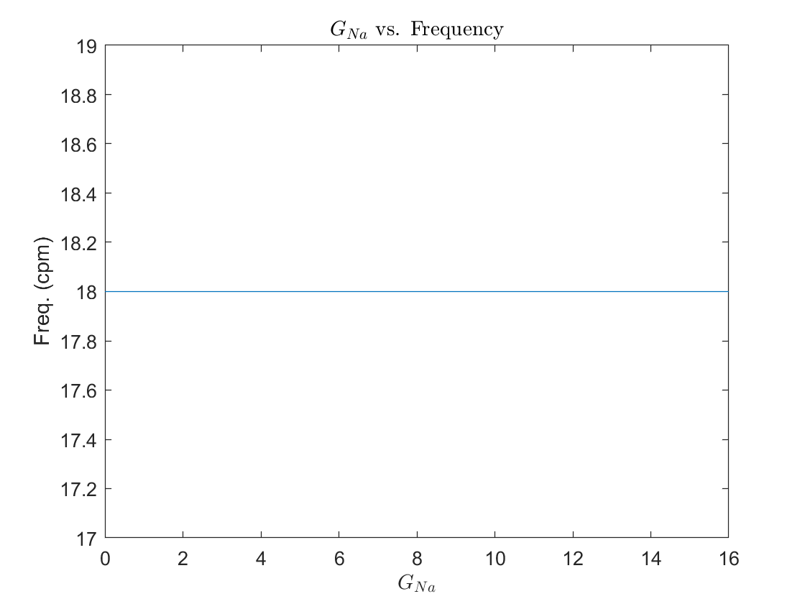
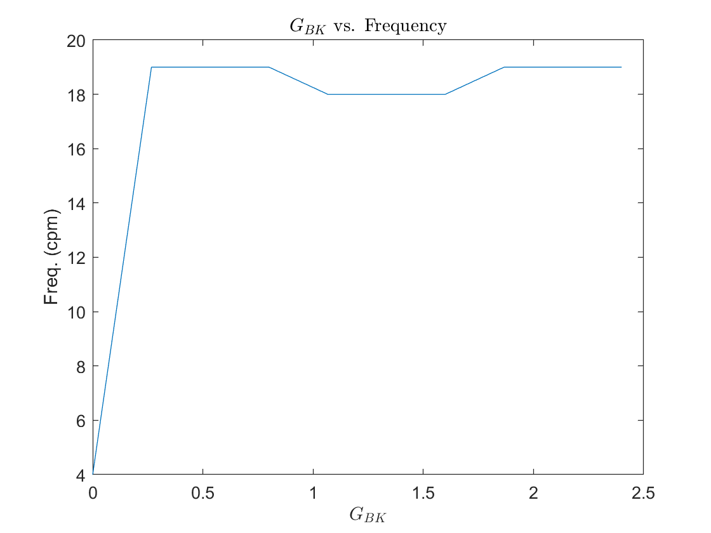
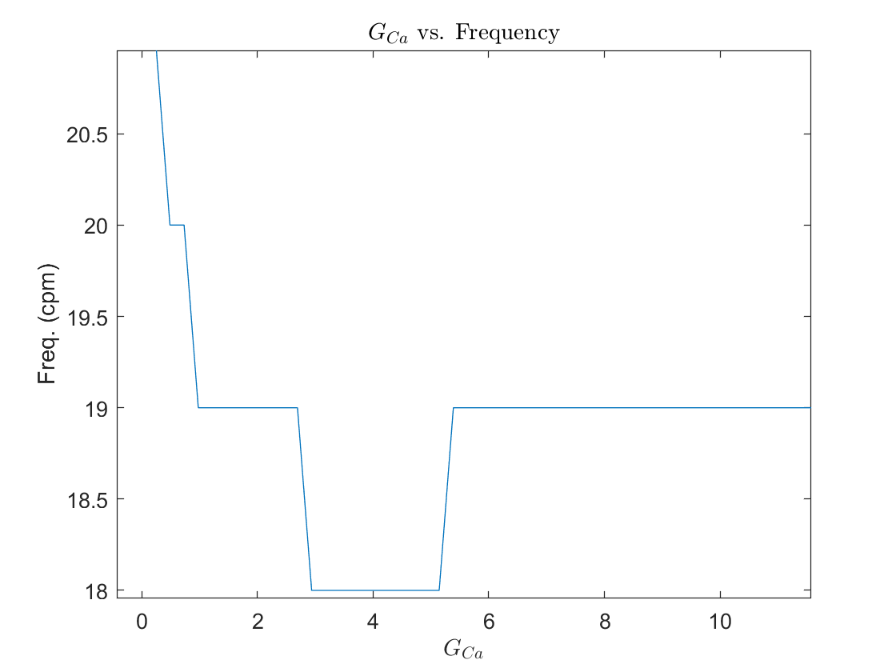

**Meeting notes**

- Regarding presentation:
  - Include number of data points, features, run-time; shows significant amount of work relating to data science
  - A bit more focus on MEA with pictures and/or diagrams
- MEA data in microV (difference is due to the equipment used in Hong Kong)
- OpenCOR units should have milli prefix defined (check again)
- Differences also arise due to measuring the relative difference between inside and outside cell vs. close to cell outside and far away from cell outside

- $G_{Na}$ behaviour is expected ... need explanation, $I_{Na}$ has a shorter voltage thing ... probably ask Peng for a re explanation (and ask for IP3 as well, or do research on it first then ask)
- Research how to properly calibrate a model. An idea was to keep $\eta$ constant and vary $\beta$ to match becaues $\eta$ has a non-linear relationship with frequency - not well behaved
- Find correct $\eta$ and $\beta$ first, then change $I$ variables to simulate drug effects

### Wednesday

Started working on mid-year report.

### Thursday

Continued working on mid-year report.

Some thoughts:

- Final report should clarify between **code variables**, **model variables**, **model parameters**, and **model constants** - define these at the start
- Summarise experimental data and add to appendix
- Surface plot needs axes
- Figure formatting/layout

### Friday

Mid-year report completed.

### Sunday

`main_script.m` renamed to `explore_model.m`, now only handles exploring $\eta$ and $\beta$. Created new script `calibrate_model.m` for calibrating $\eta$ and $\beta$. Model script takes new variable `tspan` which is the period of time to simulate.

---

Average of all baseline frequencies is 18. (Deprecated)

---

**fminsearch results**

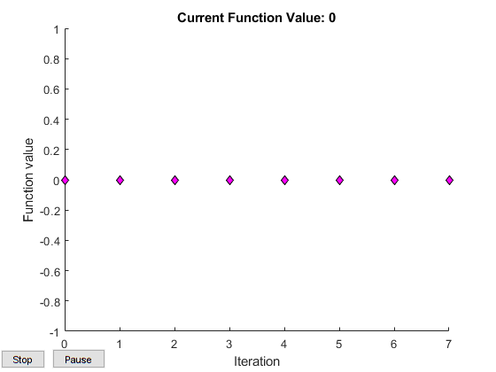


**fminunc results**

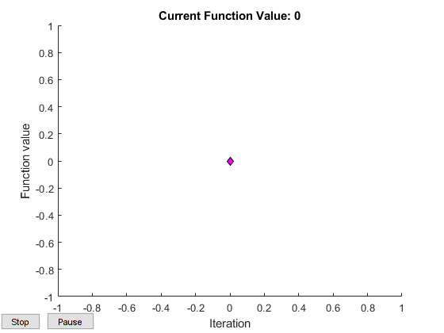


`fminunc` (which requires Optimisation Toolbox) is much faster than `fminsearch`. Results are the same: use default parameters and $Cor$ = 4. In hindsight, could have just used this from the beginning, but was necessary to understand the problem and imported code.

Some suggestions as to why fminunc has much fewer iterations: https://www.mathworks.com/matlabcentral/answers/90374-fminsearch-finds-local-minimum-when-fminunc-does-not

Some other alternatives are `ga` (Global Optimisation Toolbox) and `fmincon`. But `ga` is not the best here because we know the objective surface/landscape? (look up what it's called), so we are not making use of domain knowledge. `fmincon` requires formulating the problem as a system of constraints, which is not worth the time and effort.

**Calibrated values: $\beta$=0.000975, $\eta$=0.0389.**

---

**Characteristics**

Using the `pulsewidth`, `risetime`, and `falltime` functions from Signal Processing Toolbox, different characteristics can be found. For the final report, **add a long plot of many pulses then compile all together** (like a comic book). This shows that the characteristics are averaged.

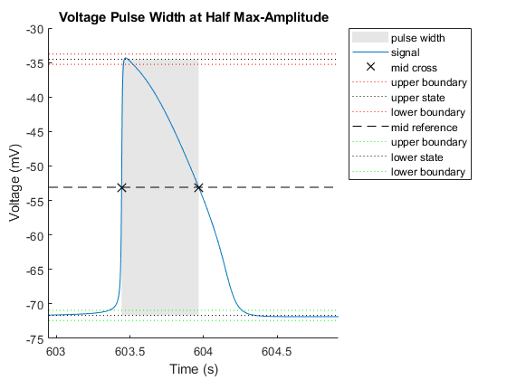
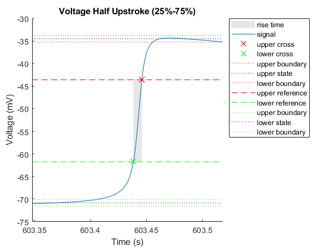
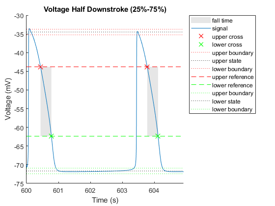


Note: all characteristics are in seconds.

Can't do overshoot and undershoot because simulation doesn't do either.

---

Idea - in the final report, define the following terms:

- Model parameter
- Model variable
- Model constant
- Calibration
- Perturbation analysis

---

To do next: perturbation analysis on current conductances to see effects on characteristics, i.e. frequency, upstroke, downstroke, width.

## Week 4

### Monday

**Meeting notes**

- Non-integer frequency data are from intervals, i.e. incomplete waves
- We can justify the perturbation analysis by saying that by slightly altering some parameters, we cover the full range of experimental data, i.e. variations due to natural effects, in case experimental data is a little off
- With simulated data, we can calculate *exactly* what the frequency is -- find a MATLAB function that can count non-integer frequencies

### Sunday

Added `last_peak` to the model script. It now prints the time of the last peak; this allows for calculating non-integer frequencies.

New calibration is as follows:

- Updated average from experimental data is 17.525. This is excluding 2-Ach-At and 05_0201_ach-hex
- Simulate for 90s after 10 minutes, this allows more accurate calculation of frequency
- Take frequency to be $\frac{peaks - 1}{(last\_peak-600000)/60000}$. This is the number of peaks per minute, i.e. cpm
- The -1 is to account for the repeated counting of the first and last peak
- Recalibrate the model

Updated results with `fminsearch`

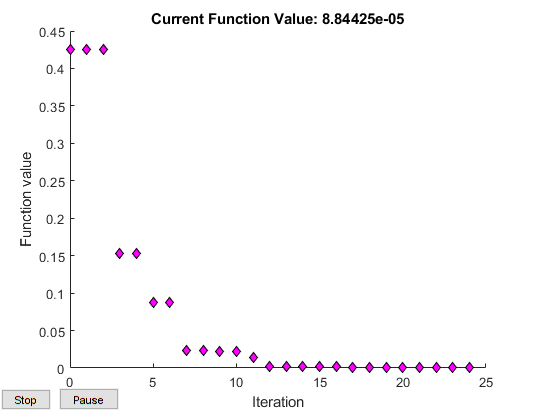


This looks like a better optimistaion programme. And now we have new model parameters.

Updated results with `fminunc`

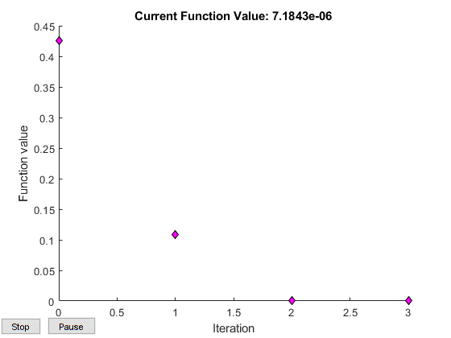


This is also a much better looking output.

There appears to be some differences in the results. This is expected because this problem has infinite optima. The difference in objective values is so minimal it's negligible. `fminunc` did yield a slightly better objective value, however, both are below the convergence tolerance threshold. One thing to note is run time. `fminunc` took 62.9% longer to run than `fminsearch`, with essentially the same result.

`ga` again took way too long.

Updated parameters (use `fminunc` because of better objective value):

---

$\beta=0.00099$

$\eta=0.039264$

---

Updated pulse characteristics:

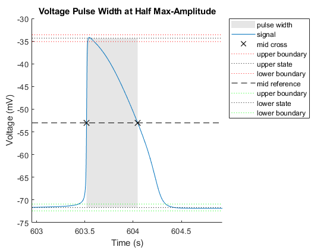
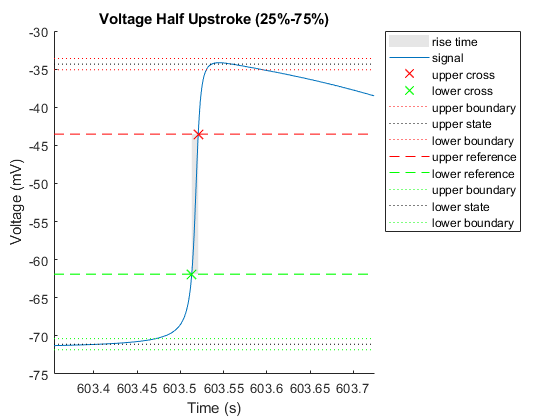


These are the pulse characteristics of the baseline model.

---

**Effects of current conductances**

New code: `current_conductances.m`. Outputs:

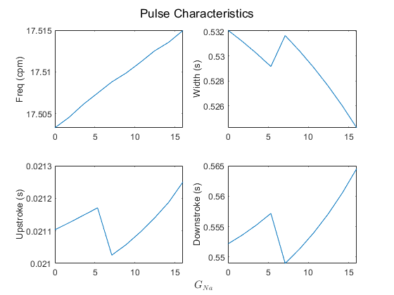

Frequency slightly increases linearly with $G_{Na}$. Note that this has been done earlier. In the report, make sure this is not talked about/shown twice. Other characteristics seem to make sense. The width decreases, increases, then decreases again. This corresponds with upstroke and downstroke because those two show inverse trends, whilst frequency remains roughly constant.

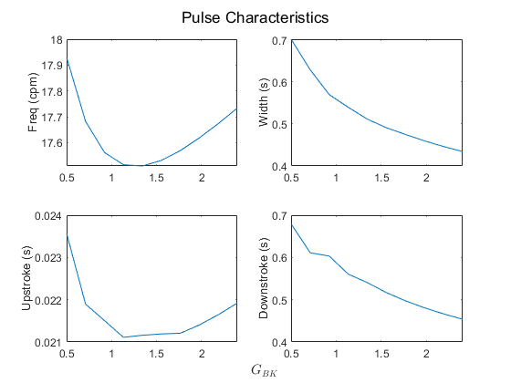

$G_{BK}$ has been altered from 0.5 to 2.4 because when it is 0, there are no pulses (flatline), so the width is NA.

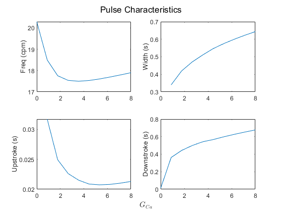

---

Ran the following code  

```

cm example_2d.com

```

## Week 5

### Monday

**Meeting notes:**

- More literature review on effects of $G$
- Run the 2D model to steady state. Then feed the results as inputs into the model again. Repeat this for each timestep desired
- The 2D model needs to fed with the hyperparameters: $Cor$, $\beta$, and $\eta$
- Then vary the parameters across nodes, e.g. $G_{Na}$ and observe frequency
- Idea: collab with Kart to see which data points he has kept or discarded
- CMGUI?

### Thursday

From memory: `generate_list.m` reads the values in from `init.m` and uses `2d_slice_temp.ipmatc` as a template and writes to `2d_slice.ipmatc`.

**CMISS notes:**

- `example_2d.com`
  - We want to change parameters across the array
  - `fem define cell;r;2d_slice` reads in from `2d_slice.ipmatc`

- `2d_slice.ipcell`
  - Don't vary $Cor$ spatially
  - Change $Cor$ initial value to 4 (constant across all solution points)

  - `fem define mate;r;mfiles/2d_slice_temp2 cell` change `r` to `p` (read to prompt)


- Collocation name = solution name

- Enter key will go to next line (with default) at prompt

- Piecewise linear by node for varying parameters; this does linear interpolation between node points. Will then prompt for all 60 nodes.
- Probably not more than 100 solution points per element

- Linear basis type number can just be 1

- After running the simulation, `2d_slice_temp2` is produced with the parameters that were used, but this is a text file so can just use `generate_list`

MUST CHANGE PROMPT BACK TO READ (p to r)

Very small frequency gradient (don't change it too much)

- `output` folder
  - Every `.exelem` file is a timestep
  - Timesteps are in ms and defined by `dt` (in `example_2d.com` I think)
  - `dt` should be less than 100 as it takes around 100ms for waves to propagate across the whole array
  - Recommended range is 1 to 20ms
  - `.exelem` per time step
    - element is the node and values are solutions at each corner (or multiple if interpolation)
    - numbering system according to diagram (logical and sequential)
  - `grid.exelem`
    - values are the node numbers (this has the weird numbering system)

- `stomach.iphist`
  - everything arranged by time
  - (niqs,  solution point number): 6 values these are the 6 ode solutions for each state variable
  - if file getting too large, can just print 1 value (i.e. membrane potential $V_m$) by changing from `1..6` to just `1` but there are two instances to change (look for `if ($HISTORY)`)

- everything in output folder are auto generated from script

---

In the final report, define:

- element
- node
- solution points